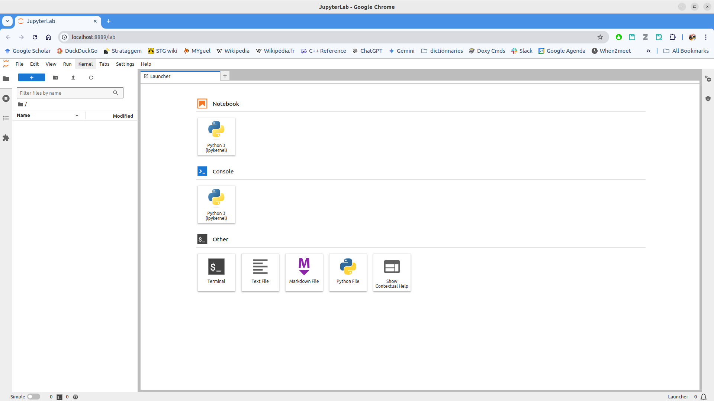

*******************************
Installer les outils logiciels
*******************************

=================
Installer conda
=================

Télécharger et installer Miniconda :

.. code-block:: bash

   mkdir -p ~/system/python/anaconda
   cd ~/system/python/anaconda
   wget https://repo.anaconda.com/miniconda/Miniconda3-py312_24.9.2-0-Linux-x86_64.sh -O Miniconda3-2024.09.sh
   bash Miniconda3-2024.09.sh -b -u -p miniconda312
   rm Miniconda3-2024.09.sh

Ajouter le bout de code qui suit à votre fichier de configuration du shell ``~/.bashrc``:

.. literalinclude:: resources/code/conda312_init_bashrc
   :language: bash
   :caption: Fonction pour lancer facilement conda depuis la console
   :linenos:

================================================================
Installer OpenAI Gym (gymansium version) et Jupyter avec conda
================================================================

.. code-block:: bash

   conda312_init
   conda create -n rltutorials
   conda activate rltutorials
   conda install -c conda-forge jupyterlab
   conda install swig
   pip install "gymnasium[all]"
   pip install torch

======================
Tester l'installation
======================

En lançant JupyterLab

Soit dans la même console que celle où vous avez lancé la dernière commande (``pip install gym``):

.. code-block:: bash

   jupyter lab

Soit dans une nouvelle console, lancez:

.. code-block:: bash

   conda312_init
   conda activate rltutorials
   jupyter lab

Cela doit ouvrir une nouvelle fenêtre ou un nouvel onglet de navigateur avec JupyterLab, comme sur l'image ci-dessous:

Dans cette fenêtre tester l'exemple suivant de gymnasium:

.. code-block:: python

   import gymnasium as gym

   # Initialise the environment
   env = gym.make("LunarLander-v3", render_mode="human")

   # Reset the environment to generate the first observation
   observation, info = env.reset(seed=42)
   for _ in range(1000):
      # this is where you would insert your policy
      action = env.action_space.sample()

      # step (transition) through the environment with the action
      # receiving the next observation, reward and if the episode has terminated or truncated
      observation, reward, terminated, truncated, info = env.step(action)

      # If the episode has ended then we can reset to start a new episode
      if terminated or truncated:
         observation, info = env.reset()

   env.close()

If there is no error, and you see the LunarLander environment, then you have successfully installed the necessary software to experiment with Reinforcement Learning using Gymnasium from farama and JupyterLab.

.. note::

   If your system does not find gymnasium: ensure you installed it with pip (`pip install "gymnasium[all]"`).

.. note::

   If you have a problem with installing gymnasium, especially problem related to the package ``box2d``, make sure you have installed the package ``swig`` with :underline:`conda` (``conda install swig``).
